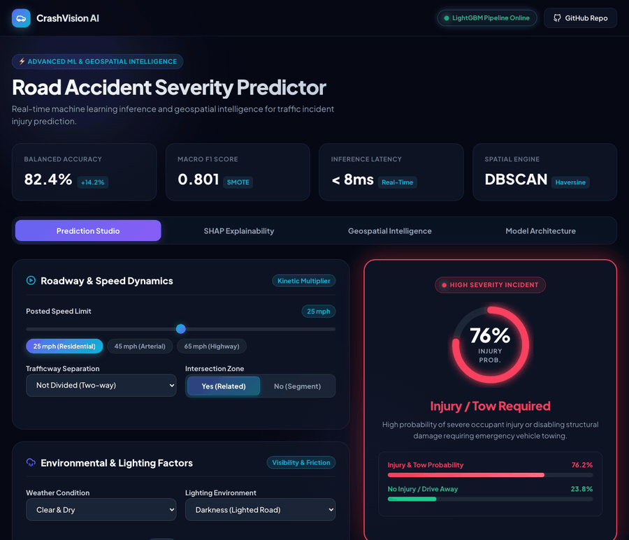

<div align="center">

# 🚦 Road Accident Severity Prediction & Geospatial Risk Mapping

Machine learning + geospatial analytics on **~940,000 Chicago traffic crashes** — severity
classification with LightGBM, SHAP/LIME explainability, and DBSCAN hotspot detection with
severity-weighted risk indices.

[](https://sanya28wd.github.io/Road-Accident-Severity-Prediction/)
[](https://www.python.org/)
[](road-accident-severity/reports/metrics.json)
[](road-accident-severity/GeospatialRisk/Chicago/dbscan_hotspots.py)
[](report/report.pdf)

### 👉 [**Try the live dashboard**](https://sanya28wd.github.io/Road-Accident-Severity-Prediction/) — adjust the inputs and watch the prediction move.

[](https://sanya28wd.github.io/Road-Accident-Severity-Prediction/)

</div>

---

## 🧭 Jump to

| | | |
|---|---|---|
| [📊 Dataset & clustering](#-dataset--dbscan-hotspot-clustering) | [📈 Risk score](#-weighted-severity-risk-score) | [🧠 Model results](#-model-results--explainability) |
| [🧱 Project structure](#-project-structure) | [🚀 Getting started](#-getting-started) | [👥 Contributors](#-contributors) |
| [📄 Project report](#-project-report) | | |

---

## 📌 What this project answers

1. **Severity prediction** — will a crash result in *injury / tow* or *no injury / drive away*, given road, weather, lighting, time and vehicle attributes?
2. **Hotspot detection** — where do crashes cluster spatially? Found with **DBSCAN** using Haversine distance.
3. **Regional risk scoring** — which of Chicago's 77 community areas carry the most severity-weighted risk, not just the most crashes?
4. **Interactive exploration** — Plotly / Folium / Dash apps, plus the published dashboard above.

---

<details open>
<summary><h2>📊 Dataset & DBSCAN Hotspot Clustering</h2></summary>

### Chicago Traffic Crashes — *~940,000 records*

- **Source**: City of Chicago `Traffic_Crashes_-_Crashes.csv` (173 MB, not committed — see [Getting started](#-getting-started)).
- **Spatial unit**: the 77 official Chicago Community Areas (`Boundaries - Community Areas`).
- **Processing**:
  - Full cleaning pipeline: missing values, temporal features, injury categorisation.
  - Spatial join linking crash point geometries to the 77 community-area polygons (`EPSG:4326`).
  - **Scalable grouped DBSCAN** — clustering runs per community area (`group_col="community_area_number"`) so ~940k points cluster without blowing up memory on a single global distance matrix.
  - Crash-level, community-level and cluster-level severity risk indices.
- **Visualisations**: Dash apps (`dashapp.py`, `interactive_dash.py`) with live filtering by community area, minimum crash threshold and severity category.

</details>

<details>
<summary><h2>📈 Weighted Severity Risk Score</h2></summary>

Raw crash counts reward busy roads, not dangerous ones. Each region and cluster instead gets a
severity-weighted index:

$$\text{Risk Index} = \frac{3 \times \text{Fatal} + 2 \times \text{Incapacitating} + 1 \times \text{Non-Incapacitating} + 0.5 \times \text{Possible Injury}}{\text{Total Crashes}}$$

| Severity level | Weight | Description |
|---|---|---|
| **Fatal injury** | `3.0` | Fatal crashes |
| **Incapacitating injury** | `2.0` | Severe injuries requiring hospitalisation |
| **Non-incapacitating injury** | `1.0` | Evident but non-incapacitating injuries |
| **Possible injury** | `0.5` | Reported minor injury / pain |

A higher score means severe and fatal outcomes are concentrated there relative to crash volume.

</details>

<details>
<summary><h2>🧠 Model Results & Explainability</h2></summary>

Binary target: `INJURY AND / OR TOW DUE TO CRASH` vs `NO INJURY / DRIVE AWAY`.
Five-fold stratified cross-validation, SMOTE for class imbalance.

| Model | Macro F1 | Balanced accuracy |
|---|---|---|
| **LightGBM** ✅ | **0.804** | **0.797** |
| XGBoost | 0.804 | 0.796 |
| ExtraTrees | 0.781 | 0.770 |
| LogReg + SMOTE | 0.743 | 0.785 |
| LogisticRegression | 0.741 | 0.785 |

**Held-out test set (LightGBM):** macro F1 **0.806**, balanced accuracy **0.799**
— see [`reports/metrics.json`](road-accident-severity/reports/metrics.json).

**Explainability** (`explainability.py`): SHAP global + local attribution and LIME instance
explanations, highlighting speed limit, road alignment, weather and lighting as the dominant
severity drivers. Outputs land in [`reports/explainability_outputs/`](road-accident-severity/reports/explainability_outputs).

</details>

<details>
<summary><h2>🧱 Project Structure</h2></summary>

```
Road-Accident-Severity-Prediction/
├── README.md
├── requirements.txt
├── assets/dashboard-demo.gif
└── road-accident-severity/
    ├── modelling.py                   # Training & cross-validation
    ├── explainability.py              # SHAP / LIME analysis
    ├── reports/                       # Confusion matrix, CV comparison, SHAP outputs
    └── GeospatialRisk/Chicago/
        ├── cleaning.py                # Crash data cleaning pipeline
        ├── prepare_geodata.py         # GeoDataFrame + spatial join (77 community areas)
        ├── dbscan_hotspots.py         # Per-community-area DBSCAN clustering
        ├── severity_pipeline.py       # Crash / area / cluster risk scoring
        └── app/
            ├── dashapp.py             # Choropleth & hotspot dashboard
            └── interactive_dash.py    # Dash app with live filters
```

</details>

<details>
<summary><h2>🚀 Getting Started</h2></summary>

### 1. Install

```bash
git clone https://github.com/Chirudeva-Reddy/Road-Accident-Severity-Prediction.git
cd Road-Accident-Severity-Prediction
git checkout geospatial-clustering-chicago
pip install -r requirements.txt
```

### 2. Get the crash data

The 173 MB crash CSV is gitignored. Download **Traffic Crashes – Crashes** from the
[Chicago Data Portal](https://data.cityofchicago.org/Transportation/Traffic-Crashes-Crashes/85ca-t3if)
and save it to:

```
road-accident-severity/GeospatialRisk/Chicago/dataset/Traffic_Crashes_-_Crashes.csv
```

### 3. Run the geospatial pipeline

```bash
cd road-accident-severity
python -m GeospatialRisk.Chicago.prepare_geodata
python -m GeospatialRisk.Chicago.dbscan_hotspots
python -m GeospatialRisk.Chicago.severity_pipeline
```

> The modules use relative imports, so run them with `-m` from inside `road-accident-severity/`
> — the repo root folder name contains hyphens and is not a valid Python package name.

### 4. Launch the interactive dashboard

```bash
python GeospatialRisk/Chicago/app/interactive_dash.py
```

Then open `http://127.0.0.1:8050/`.

</details>

---

## 📄 Project Report

The full write-up — motivation, workflow, algorithms, results, SHAP/LIME analysis and the
geospatial study — is typeset in LaTeX:

- **[report/report.pdf](report/report.pdf)** — 15 pages, compiled output
- [report/report.tex](report/report.tex) — source; rebuild with `latexmk -pdf report.tex` from `report/`
- [report/shap-percent-table.tex](report/shap-percent-table.tex) — generated from `shap_top20_percent.csv`

---

## 👥 Contributors

<div align="center">

| [<br><sub><b>Aarushi Kothari</b></sub>](https://github.com/aarushi4-ux) | [<br><sub><b>Shreiya Muthuvelan</b></sub>](https://github.com/Shreiya-Muthuvelan) | [<br><sub><b>Chirudeva Reddy</b></sub>](https://github.com/Chirudeva-Reddy) | [<br><sub><b>Sanya Wadhawan</b></sub>](https://github.com/sanya28wd) |
| :---: | :---: | :---: | :---: |
| `2023A7PS0342U` | `2023A7PS0343U` | `2023A7PS0331U` | `2023A7PS0296U` |

</div>

**Supervisor:** Dr. Ashish Gupta  
**Institution:** BITS Pilani — Dubai Campus, DIAC, Dubai, U.A.E.

Academic project. Licensed for educational and research use.
